Descriptive Statistics and Graphics
================
Thomas Bryan Smith[^1] <br/>
January 31, 2025

- [1 Loading Packages and Reading
  Data](#1-loading-packages-and-reading-data)
- [2 Measures of Central Tendency and
  Dispersion](#2-measures-of-central-tendency-and-dispersion)
- [3 Frequency Tables](#3-frequency-tables)
- [4 Base R Graph Functions](#4-base-r-graph-functions)
- [5 3-Dimensional Scatter Plots](#5-3-dimensional-scatter-plots)
- [6 ggplot2](#6-ggplot2)

# 1 Loading Packages and Reading Data

This code chunk imports the data, and creates some objects used in the
following. Packages are not loaded until the relevant code chunk.

``` r
# install relevant packages:
# install.packages(c("readr", "Hmisc", "pastecs", "psych",
#                    "scatterplot3d", "rgl", "Rcmdr", "ggplot2",
#                    "scales"))

# Load relevant packages:
library(tidyverse)
```

    ## Warning: package 'tidyverse' was built under R version 4.3.3

    ## Warning: package 'ggplot2' was built under R version 4.3.3

    ## ── Attaching core tidyverse packages ──────────────────────── tidyverse 2.0.0 ──
    ## ✔ dplyr     1.1.2     ✔ readr     2.1.4
    ## ✔ forcats   1.0.0     ✔ stringr   1.5.0
    ## ✔ ggplot2   3.5.0     ✔ tibble    3.2.1
    ## ✔ lubridate 1.9.2     ✔ tidyr     1.3.0
    ## ✔ purrr     1.0.2     
    ## ── Conflicts ────────────────────────────────────────── tidyverse_conflicts() ──
    ## ✖ dplyr::filter() masks stats::filter()
    ## ✖ dplyr::lag()    masks stats::lag()
    ## ℹ Use the conflicted package (<http://conflicted.r-lib.org/>) to force all conflicts to become errors

``` r
library(readr)
library(Hmisc)
```

    ## Warning: package 'Hmisc' was built under R version 4.3.3

    ## 
    ## Attaching package: 'Hmisc'
    ## 
    ## The following objects are masked from 'package:dplyr':
    ## 
    ##     src, summarize
    ## 
    ## The following objects are masked from 'package:base':
    ## 
    ##     format.pval, units

``` r
library(pastecs)
```

    ## Warning: package 'pastecs' was built under R version 4.3.3

    ## 
    ## Attaching package: 'pastecs'
    ## 
    ## The following objects are masked from 'package:dplyr':
    ## 
    ##     first, last
    ## 
    ## The following object is masked from 'package:tidyr':
    ## 
    ##     extract

``` r
library(psych)
```

    ## Warning: package 'psych' was built under R version 4.3.3

    ## 
    ## Attaching package: 'psych'
    ## 
    ## The following object is masked from 'package:Hmisc':
    ## 
    ##     describe
    ## 
    ## The following objects are masked from 'package:ggplot2':
    ## 
    ##     %+%, alpha

``` r
library(scatterplot3d)
library(rgl)
```

    ## Warning: package 'rgl' was built under R version 4.3.3

``` r
library(Rcmdr)
```

    ## Warning: package 'Rcmdr' was built under R version 4.3.3

    ## Loading required package: splines
    ## Loading required package: RcmdrMisc

    ## Warning: package 'RcmdrMisc' was built under R version 4.3.3

    ## Loading required package: car

    ## Warning: package 'car' was built under R version 4.3.3

    ## Loading required package: carData
    ## 
    ## Attaching package: 'car'
    ## 
    ## The following object is masked from 'package:psych':
    ## 
    ##     logit
    ## 
    ## The following object is masked from 'package:dplyr':
    ## 
    ##     recode
    ## 
    ## The following object is masked from 'package:purrr':
    ## 
    ##     some
    ## 
    ## Loading required package: sandwich

    ## Warning: package 'sandwich' was built under R version 4.3.3

    ## 
    ## Attaching package: 'RcmdrMisc'
    ## 
    ## The following object is masked from 'package:psych':
    ## 
    ##     reliability
    ## 
    ## The following object is masked from 'package:Hmisc':
    ## 
    ##     Dotplot
    ## 
    ## Loading required package: effects

    ## Warning: package 'effects' was built under R version 4.3.3

    ## lattice theme set by effectsTheme()
    ## See ?effectsTheme for details.
    ## The Commander GUI is launched only in interactive sessions
    ## 
    ## Attaching package: 'Rcmdr'
    ## 
    ## The following object is masked from 'package:base':
    ## 
    ##     errorCondition

``` r
library(scales)
```

    ## Warning: package 'scales' was built under R version 4.3.3

    ## 
    ## Attaching package: 'scales'
    ## 
    ## The following objects are masked from 'package:psych':
    ## 
    ##     alpha, rescale
    ## 
    ## The following object is masked from 'package:purrr':
    ## 
    ##     discard
    ## 
    ## The following object is masked from 'package:readr':
    ## 
    ##     col_factor

``` r
# Import the data
df <- readRDS("./Data/person.rds")

# Check your data
df %>% head()
```

    ## # A tibble: 6 × 18
    ##    YEAR YEARQ IDPER      IDHH    V3014 V3018 V3020 WGTPER   YIH WGTVIC_V VIOLENT
    ##   <dbl> <fct> <fct>      <fct>   <fct> <fct> <fct>  <dbl> <dbl>    <dbl>   <dbl>
    ## 1  2000 001   2000966984 200099… 40-49 Male  Coll…  1063.    10      NA        0
    ## 2  2000 001   2000951294 200099… 40-49 Fema… Coll…   894.     9      NA        0
    ## 3  2000 001   2000470356 200099… 12-17 Male  Elem…  1317.     9      NA        0
    ## 4  2000 001   2000205990 200016… 35-39 Male  Coll…  1093.     4      NA        0
    ## 5  2000 001   2000361146 200016… 30-34 Fema… Coll…  1101.     4    2202.       1
    ## 6  2000 001   2000879996 200073… 40-49 Male  High…  1063.     6      NA        0
    ## # ℹ 7 more variables: WGTVIC_NV <dbl>, NONVIOLENT <dbl>, ADJINC_WT_V <dbl>,
    ## #   VLNT_WGT_V <dbl>, ADJINC_WT_NV <dbl>, NVLNT_WGT_V <dbl>, EDUC <fct>

``` r
# Using the indexing learned in the previous workshop further check your data.
# This can be done either by indexing by the column number:
df[, 5:9] %>% head()
```

    ## # A tibble: 6 × 5
    ##   V3014 V3018  V3020       WGTPER   YIH
    ##   <fct> <fct>  <fct>        <dbl> <dbl>
    ## 1 40-49 Male   College      1063.    10
    ## 2 40-49 Female College       894.     9
    ## 3 12-17 Male   Elementary   1317.     9
    ## 4 35-39 Male   College      1093.     4
    ## 5 30-34 Female College      1101.     4
    ## 6 40-49 Male   High school  1063.     6

``` r
# Or by indexing the column names:
df[, c("V3014", "V3018", "V3020", "WGTPER", "YIH")] %>% head()
```

    ## # A tibble: 6 × 5
    ##   V3014 V3018  V3020       WGTPER   YIH
    ##   <fct> <fct>  <fct>        <dbl> <dbl>
    ## 1 40-49 Male   College      1063.    10
    ## 2 40-49 Female College       894.     9
    ## 3 12-17 Male   Elementary   1317.     9
    ## 4 35-39 Male   College      1093.     4
    ## 5 30-34 Female College      1101.     4
    ## 6 40-49 Male   High school  1063.     6

``` r
# Or by using the select() function from dplyr:
df %>%
  select(V3014, V3018, V3020, WGTPER, YIH) %>%
  head()
```

    ## # A tibble: 6 × 5
    ##   V3014 V3018  V3020       WGTPER   YIH
    ##   <fct> <fct>  <fct>        <dbl> <dbl>
    ## 1 40-49 Male   College      1063.    10
    ## 2 40-49 Female College       894.     9
    ## 3 12-17 Male   Elementary   1317.     9
    ## 4 35-39 Male   College      1093.     4
    ## 5 30-34 Female College      1101.     4
    ## 6 40-49 Male   High school  1063.     6

``` r
# Some of the column names for variables we want to work with are
# unintuitive, let's update a couple of them:
colnames(df)[which(colnames(df) %in% c("V3014",
                                       "V3018"))] <- c("AGE",
                                                       "SEX")

# Now let's extract just the columns we want to work with:
(df <- df %>%
   select(YEAR, YEARQ, IDPER, AGE, SEX,
          EDUC, YIH, VIOLENT, NONVIOLENT))
```

    ## # A tibble: 45,776 × 9
    ##     YEAR YEARQ IDPER      AGE   SEX    EDUC    YIH VIOLENT NONVIOLENT
    ##    <dbl> <fct> <fct>      <fct> <fct>  <fct> <dbl>   <dbl>      <dbl>
    ##  1  2000 001   2000966984 40-49 Male   FE       10       0          0
    ##  2  2000 001   2000951294 40-49 Female FE        9       0          0
    ##  3  2000 001   2000470356 12-17 Male   NHSE      9       0          0
    ##  4  2000 001   2000205990 35-39 Male   FE        4       0          0
    ##  5  2000 001   2000361146 30-34 Female FE        4       1          0
    ##  6  2000 001   2000879996 40-49 Male   HSE       6       0          0
    ##  7  2000 001   2000840437 40-49 Female HSE       6       0          0
    ##  8  2000 001   2000494053 35-39 Male   HSE      11       0          0
    ##  9  2000 001   2000833192 40-49 Female HSE      11       0          0
    ## 10  2000 001   2000365150 30-34 Female HSE       8       0          1
    ## # ℹ 45,766 more rows

# 2 Measures of Central Tendency and Dispersion

- There are multiple ways which you can go about generating
  **descriptive statistics** using **base R**.

- For most measures of **central tendency** and **dispersion** there
  tends to be an accompanying function.

  - **Mean** can be estimated using `mean()`
  - **Median** can be estimated using `median()`
  - **Variance** can be estimated using `var()`
  - **Standard** Deviation can be estimated using `sd()`
  - **Minimum** can be estimated using `min()`
  - **Maximum** can be estimated using `max()`
    - Within the parentheses of these functions all you need do is
      insert a **numeric vector**. This can be done by inserting the
      name of a numeric vector object, indexing a numeric vector within
      a **data frame**, or generating a numeric vector within each
      function’s parentheses using the `c()` function.
    - The benefit of these functions is that they can be very easily
      inserterted into other functions.
    - E.g. you could **index** a data frame with the `median()`
      function, asking R to print all observations who reported the
      median score: `df[df$AGE==median(df$AGE),]`
  - The `summary()` function is a base R function which reports the
    minimum, quartiles, median, mean, and maximum for numeric vectors
    and counts for factors.

- The **dplyr** package is much more user friendly than these **base R**
  functions. For measures of central tendency and dispersion, most of
  the above can be achieved with only the following functions, removing
  the need for **base R**’s unnecessarily complex indexing:

  - `filter()` is used to filter out observations based on logical
    statements.
  - `select()` is used to select which variables you wish to summarize.
  - `group_by()` is used to estimate descriptives by the levels of a
    given variable.
  - `summarize()` is used to estimate all of the above descriptive
    statistics within a single function.

- There are also plenty of alternatives which are able to report a wide
  array of descriptive statistics.

  - The **psych** package offers the `describe()` function which will
    report the variable position, number of valid observations, mean,
    median, trimmed mean, median absolute deviation (from the median),
    minimum, maximum, range, skew, kurtosis, and standard errors.
  - The **Hmisc** package offers another `describe()` function which
    will report the number of valid responses, number of missing
    responses, number of distinct responses, proportional odds/Wilcoxon
    test, mean, Gini’s mean difference, the scores on a variable at the
    5th, 10th, 25th, 50th, 75th, 90th, and 95th percentiles, and the 5
    highest and lowest scores.
    - When both **psych** and **Hmisc** are loaded you need to precede
      their respectivr `describe()` functions with the name of the
      package you wish to use followed by two colons
      (e.g. `psych::describe()`). If you fail to do so R will assume you
      want to use the `describe()` function from the most recently
      loaded package.
  - The **pastecs** function offers the `stat.desc()` function which
    reports the number of unique values, number of null responses,
    number of missing data, minimum, maximum, range, sum, median, mean,
    mean standard error mean, mean confidence interval, variance,
    standard deviation, and coefficient of variation.
    - The packages will only estimate summary statistics for numeric and
      factor vectors - character vectors have no associated numeric
      value.

``` r
# The simplest method of estimating descriptive statistics is to do so
# individually for each vector you are interested in. Since each variable is
# a vector of your data frame you can either extract the vector for
# the variable of interest, or index your data frame object such that
# you are targeting the vector for the variable interest.

# Get "years in household" variable as a separate numeric vector.
yih <- df$YIH
yih %>% head()
```

    ## [1] 10  9  9  4  4  6

``` r
# Get "education level" variable as a separate factor vector.
educ <- df$EDUC
educ %>% head()
```

    ## [1] FE   FE   NHSE FE   FE   HSE 
    ## Levels: NHSE HSE FE MA PHD

``` r
# Invidual statistics were introduced in the previous classes
# so here we are going to focus on approaches to calculating complete
# tables of descriptive statistics.

# But, just to recap:
# Median
median(yih, na.rm = TRUE)
```

    ## [1] 6

``` r
# Mean
mean(yih, na.rm = TRUE)
```

    ## [1] 8.370709

``` r
# Variance
var(yih, na.rm = TRUE)
```

    ## [1] 87.26201

``` r
# Standard Deviation
sd(yih, na.rm = TRUE)
```

    ## [1] 9.341414

``` r
# Minimum
min(yih, na.rm = TRUE)
```

    ## [1] 0.08333333

``` r
# Maximum
max(yih, na.rm = TRUE)
```

    ## [1] 60

``` r
# The stats package equips you with the fivenum() function.
# This function returns the minimum, 25th percentile,
# median, 75th percentile, and maximum in a single vector.
fivenum(yih)
```

    ## [1]  0.08333333  2.00000000  6.00000000 11.00000000 60.00000000

``` r
# The sapply() function, from the apply() family of functions,
# can be used to apply a statistical function across all columns
# of an input data frame. You just need to make sure you index
# the data frame to extract the columns you want to describe:
sapply(df[, c("YEAR", "YIH", "VIOLENT", "NONVIOLENT")],
       mean,
       na.rm = TRUE)
```

    ##         YEAR          YIH      VIOLENT   NONVIOLENT 
    ## 2.007830e+03 8.370709e+00 7.777001e-03 3.602324e-02

``` r
# But, after a little bit of practice with these functions,
# it is much easier to generate descriptives for all of your
# variables using dplyr:
df %>%
  summarise(median = c(median(YIH, na.rm = TRUE),
                       median(as.numeric(AGE), na.rm = TRUE)),
            mean = c(mean(YIH, na.rm = TRUE),
                     mean(as.numeric(AGE), na.rm = TRUE)),
            sd = c(sd(YIH, na.rm = TRUE),
                   sd(as.numeric(AGE), na.rm = TRUE)),
            min = c(min(YIH, na.rm = TRUE),
                    min(as.numeric(AGE), na.rm = TRUE)),
            max = c(max(YIH, na.rm = TRUE),
                    max(as.numeric(AGE), na.rm = TRUE)))
```

    ## Warning: Returning more (or less) than 1 row per `summarise()` group was deprecated in
    ## dplyr 1.1.0.
    ## ℹ Please use `reframe()` instead.
    ## ℹ When switching from `summarise()` to `reframe()`, remember that `reframe()`
    ##   always returns an ungrouped data frame and adjust accordingly.
    ## Call `lifecycle::last_lifecycle_warnings()` to see where this warning was
    ## generated.

    ## # A tibble: 2 × 5
    ##   median  mean    sd    min   max
    ##    <dbl> <dbl> <dbl>  <dbl> <dbl>
    ## 1      6  8.37  9.34 0.0833    60
    ## 2      6  5.16  2.25 1          8

``` r
# Note: this code is "deprecated", meaning that the developers
# of dplyr consider it to be "of little value". As in most cases,
# this is because there is a "better" (easier or more appropriate) 
# approach to getting the same result. Here, if you read the error,
# it is telling us to use the newer reframe() function:
df %>%
  reframe(median = c(median(YIH, na.rm = TRUE),
                     median(as.numeric(AGE), na.rm = TRUE)),
          mean = c(mean(YIH, na.rm = TRUE),
                   mean(as.numeric(AGE), na.rm = TRUE)),
          sd = c(sd(YIH, na.rm = TRUE),
                 sd(as.numeric(AGE), na.rm = TRUE)),
          min = c(min(YIH, na.rm = TRUE),
                  min(as.numeric(AGE), na.rm = TRUE)),
          max = c(max(YIH, na.rm = TRUE),
                  max(as.numeric(AGE), na.rm = TRUE)))
```

    ## # A tibble: 2 × 5
    ##   median  mean    sd    min   max
    ##    <dbl> <dbl> <dbl>  <dbl> <dbl>
    ## 1      6  8.37  9.34 0.0833    60
    ## 2      6  5.16  2.25 1          8

``` r
# If your eyes are rolling back into your head reading this code,
# that's fine! That was the point. Working with these base functions
# can be complicated very quickly, which is why we have packages!

# As with the stats fivenum() function, there is a suite of functions
# we can use to calculate a range of statistics at the same time:
##  Summary (Base R)
summary(yih)
```

    ##    Min. 1st Qu.  Median    Mean 3rd Qu.    Max.    NA's 
    ##  0.0833  2.0000  6.0000  8.3707 11.0000 60.0000     548

``` r
## Descriptive Statistics (pastecs)
stat.desc(yih)
```

    ##      nbr.val     nbr.null       nbr.na          min          max        range 
    ## 4.522800e+04 0.000000e+00 5.480000e+02 8.333333e-02 6.000000e+01 5.991667e+01 
    ##          sum       median         mean      SE.mean CI.mean.0.95          var 
    ## 3.785904e+05 6.000000e+00 8.370709e+00 4.392471e-02 8.609315e-02 8.726201e+01 
    ##      std.dev     coef.var 
    ## 9.341414e+00 1.115964e+00

``` r
## Describe (Hmisc)
Hmisc::describe(yih)
```

    ## yih 
    ##        n  missing distinct     Info     Mean      Gmd      .05      .10 
    ##    45228      548       72    0.997    8.371    8.968   0.3333   0.6667 
    ##      .25      .50      .75      .90      .95 
    ##   2.0000   6.0000  11.0000  20.0000  29.0000 
    ## 
    ## lowest : 0.0833333 0.166667  0.25      0.333333  0.416667 
    ## highest: 56        57        58        59        60

``` r
## Describe (Psych)
psych::describe(yih)
```

    ##    vars     n mean   sd median trimmed  mad  min max range skew kurtosis   se
    ## X1    1 45228 8.37 9.34      6    6.54 5.93 0.08  60 59.92 2.18     5.67 0.04

``` r
### Note: when you have two functions with the same name from
### two different packages, the package you read in most
### recently will "mask" the function from the earlier package.
### This means that, when you call that function, it will
### prioritize the most recent package. It is generally to avoid
### these conflicts, but in situations where you need both, you
### can use the "[package name]::" prefix to tell R which
### package you want to pull the function from. Above, we told
### R that we wanted to use Hmisc in the first instance,
### and psych in the second instance.

# Conveniently, some of these functions are already equipped
# to generate descriptives for multiple variables:
df %>%
  select(YIH, AGE, EDUC) %>%
  psych::describe()
```

    ##       vars     n mean   sd median trimmed  mad  min max range  skew kurtosis
    ## YIH      1 45228 8.37 9.34      6    6.54 5.93 0.08  60 59.92  2.18     5.67
    ## AGE*     2 45776 5.16 2.25      6    5.32 2.97 1.00   8  7.00 -0.47    -0.98
    ## EDUC*    3 42001 2.53 0.80      3    2.53 1.48 1.00   5  4.00  0.07     0.03
    ##         se
    ## YIH   0.04
    ## AGE*  0.01
    ## EDUC* 0.00

``` r
## Some of the output from this function have asterisks (*),
## this is psych's describe() function trying to inform you that
## these variables were not numeric vectors (remember, they are factors,
## but describe() is able to automatically treat them as numeric!)
## If you use mutate() to convert them into numeric vectors, these
## asterisks will go away:
df %>%
  select(YIH, AGE, EDUC) %>%
  mutate(AGE = as.numeric(AGE),
         EDUC = as.numeric(EDUC)) %>%
  psych::describe()
```

    ##      vars     n mean   sd median trimmed  mad  min max range  skew kurtosis
    ## YIH     1 45228 8.37 9.34      6    6.54 5.93 0.08  60 59.92  2.18     5.67
    ## AGE     2 45776 5.16 2.25      6    5.32 2.97 1.00   8  7.00 -0.47    -0.98
    ## EDUC    3 42001 2.53 0.80      3    2.53 1.48 1.00   5  4.00  0.07     0.03
    ##        se
    ## YIH  0.04
    ## AGE  0.01
    ## EDUC 0.00

``` r
# ============================================================================ #

# In cases where your goal is to compare groups within your data, and plan on
# implementing interaction terms in your statistical models, you will need
# to generate descriptive statistics for specific subsets of your data.

# This can be achieved through logical indexing.
# So, if we wanted to find the mean "years in household" for men,
# we would write:
mean(df$YIH[df$SEX == "Male"], na.rm = TRUE)
```

    ## [1] 8.176147

``` r
# Alternatively, for women:
mean(df$YIH[df$SEX == "Female"], na.rm = TRUE)
```

    ## [1] 8.542799

``` r
# You can also use dplyr:
df %>%
  filter(SEX == "Male",
         complete.cases(df)) %>%
  summarise(mean = mean(YIH))
```

    ## # A tibble: 1 × 1
    ##    mean
    ##   <dbl>
    ## 1  8.18

``` r
# You can combine dplyr with the sapply() function to calculate
# a given descriptive for every column in the data:
df %>%
  filter(SEX == "Male",
         complete.cases(df)) %>%
  mutate(AGE = as.numeric(AGE),
         EDUC = as.numeric(EDUC)) %>%
  select(YIH, AGE, EDUC) %>%
  sapply(mean)
```

    ##      YIH      AGE     EDUC 
    ## 8.180408 5.047716 2.516962

``` r
# Any of the above functions can accept any of the logical operations:
mean(df$YIH[as.numeric(df$AGE) >= 4], na.rm = TRUE)   # 4 is "35-39 y/o"
```

    ## [1] 9.489191

``` r
df %>%
  mutate(AGE = as.numeric(AGE)) %>%
  filter(AGE >= 4,
         !is.na(YIH)) %>%
  summarise(mean = mean(YIH))
```

    ## # A tibble: 1 × 1
    ##    mean
    ##   <dbl>
    ## 1  9.49

``` r
# Or, any combination of logical operations and functions
# (remember, "|" is "or", "&" is "and"):
mean(df$YIH[(as.numeric(df$AGE) >= 5) |       # TRUE if >= "35-39 y/o"
            (as.numeric(df$AGE) <= 2)],       # TRUE if <= "18-24 y/o"
     na.rm = TRUE)
```

    ## [1] 9.382657

``` r
mean(df$YIH[(as.numeric(df$AGE) >= 4) &       # TRUE if >= "35-39 y/o"
            (!is.na(df$YIH))])                # TRUE for non-missing
```

    ## [1] 9.489191

# 3 Frequency Tables

- The base R function `table()` is a fairly comprehensive means of
  generating frequency tables. Like the **central tendency** and
  **dispersion** functions, the `table()` function is applied to
  vectors. However, unlike the aforementioned functions, the `table()`
  function can be applied to character vectors, wherein it will count
  the frequencies of each unique arrangement of characters in the
  vector.
- The `table()` function generates table objects which function
  similarly to both named numeric vectors. As a result you can apply to
  the output of the `table()` function any other function which can
  target a vector. For example, you can estimate the **mean** number of
  observations across all categories in your frequency table by placing
  a the `table()` function inside of the `mean()`, like so:
  `mean(table(data))`. Alternatively, you could assign the results of
  the `table()` vector to an object and use the `mean()` function on
  that object.
- Crosstabs, or two-way tables, can be generated by adding a second
  dimension to the `table()` function following a comma: `table(a,b)`.
  In this example, `a` is the vector which populates the rows of the
  crosstab and `b` is the vector which populates the columns of the
  crosstab.
  - It is important to note that the resulting output can still function
    like a named numeric vector and can be indexed using only one
    dimention (e.g. `table[1]`). However, a crosstab resulting from the
    `table()` function can also be indexed with two dimensions as you
    would a data frame (e.g. `table[1,1]`).
- The `margin.table()` and `prop.table()` functions allow you to
  estimate marginal and total frequencies, and row, column, and cell
  proportions for your table. As before, if you have assigned your table
  to an object, you can simply place this object within the parentheses
  of these functions. Alternatively, you can place the `table()`
  function within the `prop.table()` and `margin.table()` functions:
  `prop.table(table(data))` would generate the cell proportions for the
  table generated from the `data` data frame.
  - This technique of inserting functions within functions applies to
    most functions available in R. That being said, be careful when
    doing so as it can complicate your script. Additionally, remember
    that R functions like a mathematical language, functions within the
    parentheses will be completed first.
- The `summary()` function discussed in the previous section can also be
  applied to tables, generating the total number of cases, number of
  variables, chi-square, degrees of freedom, and p-value.

``` r
# Frequency tables for a single categorical variable can be generated using
# the table() function. This is something mentioned in the previous module.

# Tabling the age variable:
table(df$AGE)
```

    ## 
    ## 12-17 18-24 25-29 30-34 35-39 40-49 50-59   60+ 
    ##  4382  3945  3410  4378  4966  9548  7127  8020

``` r
# Tabling the education variable:
table(df$EDUC)
```

    ## 
    ##  NHSE   HSE    FE    MA   PHD 
    ##  3909 15933 18554  3229   376

``` r
# The table function generates named, numeric vectors. So all of the
# operations and functions we have previously applied to vectors,
# can also be applied to the results of the table() function:
age <- table(df$AGE)
age[1]
```

    ## 12-17 
    ##  4382

``` r
age["30-34"]
```

    ## 30-34 
    ##  4378

``` r
age[c("30-34", "50-59")]
```

    ## 
    ## 30-34 50-59 
    ##  4378  7127

``` r
sum(age)
```

    ## [1] 45776

``` r
min(age)
```

    ## [1] 3410

``` r
max(age)
```

    ## [1] 9548

``` r
# Crosstabs are created by adding a second variable after a comma:
(myxtab <- table(df$AGE, df$EDUC))
```

    ##        
    ##         NHSE  HSE   FE   MA  PHD
    ##   12-17 2365 1915    7    2    0
    ##   18-24  123 2063 1541   22    0
    ##   25-29  162 1122 1620  159   12
    ##   30-34  181 1241 2201  332   31
    ##   35-39  177 1423 2335  421   64
    ##   40-49  221 2875 4558  871   88
    ##   50-59  150 2186 3306  768   71
    ##   60+    530 3108 2986  654  110

``` r
# From this crosstab, you can estimate the marginal frequencies
# with the margin.table() function:
margin.table(myxtab)        # Total number of observations
```

    ## [1] 42001

``` r
margin.table(myxtab, 1)     # Row frequencies (summed over columns)
```

    ## 
    ## 12-17 18-24 25-29 30-34 35-39 40-49 50-59   60+ 
    ##  4289  3749  3075  3986  4420  8613  6481  7388

``` r
margin.table(myxtab, 2)     # Col frequencies (summed over rows)
```

    ## 
    ##  NHSE   HSE    FE    MA   PHD 
    ##  3909 15933 18554  3229   376

``` r
# You can also generate the cell, row, and column proportions:
prop.table(myxtab)          # Cell proportions
```

    ##        
    ##                 NHSE          HSE           FE           MA          PHD
    ##   12-17 5.630818e-02 4.559415e-02 1.666627e-04 4.761791e-05 0.000000e+00
    ##   18-24 2.928502e-03 4.911788e-02 3.668960e-02 5.237971e-04 0.000000e+00
    ##   25-29 3.857051e-03 2.671365e-02 3.857051e-02 3.785624e-03 2.857075e-04
    ##   30-34 4.309421e-03 2.954692e-02 5.240351e-02 7.904574e-03 7.380777e-04
    ##   35-39 4.214185e-03 3.388015e-02 5.559391e-02 1.002357e-02 1.523773e-03
    ##   40-49 5.261779e-03 6.845075e-02 1.085212e-01 2.073760e-02 2.095188e-03
    ##   50-59 3.571344e-03 5.204638e-02 7.871241e-02 1.828528e-02 1.690436e-03
    ##   60+   1.261875e-02 7.399824e-02 7.109355e-02 1.557106e-02 2.618985e-03

``` r
prop.table(myxtab, 1)       # Row proportions (by column)
```

    ##        
    ##                 NHSE          HSE           FE           MA          PHD
    ##   12-17 0.5514105852 0.4464910235 0.0016320821 0.0004663092 0.0000000000
    ##   18-24 0.0328087490 0.5502800747 0.4110429448 0.0058682315 0.0000000000
    ##   25-29 0.0526829268 0.3648780488 0.5268292683 0.0517073171 0.0039024390
    ##   30-34 0.0454089313 0.3113396889 0.5521826392 0.0832915203 0.0077772203
    ##   35-39 0.0400452489 0.3219457014 0.5282805430 0.0952488688 0.0144796380
    ##   40-49 0.0256588877 0.3337977476 0.5292000464 0.1011262046 0.0102171137
    ##   50-59 0.0231445765 0.3372936275 0.5101064651 0.1185002314 0.0109550995
    ##   60+   0.0717379534 0.4206821873 0.4041689226 0.0885219274 0.0148890092

``` r
prop.table(myxtab, 2)       # Column proportions (by row)
```

    ##        
    ##                 NHSE          HSE           FE           MA          PHD
    ##   12-17 0.6050140701 0.1201907990 0.0003772771 0.0006193868 0.0000000000
    ##   18-24 0.0314658480 0.1294796962 0.0830548669 0.0068132549 0.0000000000
    ##   25-29 0.0414428243 0.0704198833 0.0873127088 0.0492412512 0.0319148936
    ##   30-34 0.0463034024 0.0778886588 0.1186267112 0.1028182100 0.0824468085
    ##   35-39 0.0452801228 0.0893114919 0.1258488736 0.1303809229 0.1702127660
    ##   40-49 0.0565361985 0.1804431055 0.2456613129 0.2697429545 0.2340425532
    ##   50-59 0.0383729854 0.1371995230 0.1781826021 0.2378445339 0.1888297872
    ##   60+   0.1355845485 0.1950668424 0.1609356473 0.2025394859 0.2925531915

``` r
# The summary() function can also be applied to crosstabs.
# It will give you the total number of cases, number of variables,
# Chi Square, Degrees of Freedom, and p-value.
summary(myxtab)
```

    ## Number of cases in table: 42001 
    ## Number of factors: 2 
    ## Test for independence of all factors:
    ##  Chisq = 14787, df = 28, p-value = 0

``` r
# All of the above can also be achieved working in the tidyverse suite:
df %>% count(AGE)
```

    ## # A tibble: 8 × 2
    ##   AGE       n
    ##   <fct> <int>
    ## 1 12-17  4382
    ## 2 18-24  3945
    ## 3 25-29  3410
    ## 4 30-34  4378
    ## 5 35-39  4966
    ## 6 40-49  9548
    ## 7 50-59  7127
    ## 8 60+    8020

``` r
df %>% group_by(AGE) %>% count(EDUC)
```

    ## # A tibble: 46 × 3
    ## # Groups:   AGE [8]
    ##    AGE   EDUC      n
    ##    <fct> <fct> <int>
    ##  1 12-17 NHSE   2365
    ##  2 12-17 HSE    1915
    ##  3 12-17 FE        7
    ##  4 12-17 MA        2
    ##  5 12-17 <NA>     93
    ##  6 18-24 NHSE    123
    ##  7 18-24 HSE    2063
    ##  8 18-24 FE     1541
    ##  9 18-24 MA       22
    ## 10 18-24 <NA>    196
    ## # ℹ 36 more rows

``` r
# However, unlike in R, tidyverse provides you with much more flexibility
# with how you subset or manage your data:
myxtab <- df %>%
  filter(VIOLENT == 1) %>%
  group_by(AGE) %>%
  count(EDUC)

# Given that the data produced by this method are presented
# listwise rather than an adjacency matrix, you have to generate
# row, column, and cell frequencies, proportions, et al. using mutate():
myxtab %>%

  group_by(AGE) %>%
  mutate(ColPcnt = (n / sum(n)) * 100) %>%        # Col Percentages

  ungroup() %>%
  group_by(EDUC) %>%
  mutate(RowPcnt = (n / sum(n)) * 100) %>%        # Row Percentages

  ungroup() %>%
  mutate(CellPcnt = (n / sum(n)) * 100)           # Cell Percentagees
```

    ## # A tibble: 31 × 6
    ##    AGE   EDUC      n ColPcnt RowPcnt CellPcnt
    ##    <fct> <fct> <int>   <dbl>   <dbl>    <dbl>
    ##  1 12-17 NHSE     18   56.2    90       8.07 
    ##  2 12-17 HSE      13   40.6    13.5     5.83 
    ##  3 12-17 <NA>      1    3.12    6.67    0.448
    ##  4 18-24 HSE      32   66.7    33.3    14.3  
    ##  5 18-24 FE       11   22.9    13.8     4.93 
    ##  6 18-24 <NA>      5   10.4    33.3     2.24 
    ##  7 25-29 NHSE      1    4       5       0.448
    ##  8 25-29 HSE      12   48      12.5     5.38 
    ##  9 25-29 FE        9   36      11.2     4.04 
    ## 10 25-29 MA        1    4       9.09    0.448
    ## # ℹ 21 more rows

# 4 Base R Graph Functions

- **Histograms** can be generated using the `hist()` function on the
  vector containing the data for a single variable. It is helpful to be
  aware of two of this function’s unique options:

  - `breaks=` lets you specify the number of bars in the histogram.
  - `freq=` is a boolean option which lets you exchange y-axis frequency
    for density.

- **Bar plots** are generated using the `barplot()` function, which,
  like the `hist()` function, has a couple of unique options:

  - `names.arg=` is used to specify the names of each bar in the plot,
    assuming that the bars are not already named (or simply if you want
    to change the names of said bars).
  - `beside=` alters the style of a bar plot which visualizes group
    membership dependent on another variable.

- You can generate **Pie charts** with the `pie()` function, the labels
  for each slice of the pie are defined using the `labels=` option.

- **Box plots** are generated using the `boxplot()` function. The
  `notch=` option is one of a handful of options which alter the
  appearance of the box plot.

- **Line charts** and **scatterplots** are both generated using the
  `plot()` function, the most versatile function of those discussed.
  Generally speaking, it plots points on a 2-dimensional plane with an x
  and y axis defined using one or two numeric vectors. When using a
  single numeric vector, `plot()` assumes you wish to generate a line
  chart plotting the points from the vector one after the other along
  the x axis, the position on the y axis dependent on the value. When
  using `plot()` with two numeric vectors it will plot the first numeric
  vector on the x axis and the second numeric vector on the y axis, thus
  producing a scatterplot.

  - Base R comes with a set of **graphical options** which are common to
    some or all of the base R graphical functions dependent on the
    option.
    - `col=` lets you specify a colour, typically for the centerpiece of
      a plot.
    - `border=` lets you specify a colour, typically for the border of
      the centerpiece of a plot.
    - `density=` lets you specify the density of colour fill, again
      usually for the centerpiece of a plot.
    - `xlim=` and `ylim=` are used to specify the range of values taken
      by the x and y axes.
    - `main=`, `xlab=`, and `ylab=` are used to label the graph, x axis,
      and y axis respectively.

- You can generate graph **legends** using the `legend()` function. The
  `legend()` function canbe used in conjunction with the `cex=` and
  `bty=` options, the former specifying the size of the legend and the
  latter identifies the type of box you want to surround the legend.

- Along with the `legend()` function, the `axis()`, `box()`, `lines()`,
  and `title()` functions will add axes, borders, lines, and titles to a
  plot. If your plot already has any of these then whatever is generated
  will be placed on top of whatever already existed. If you wish to use
  these functions I would recommend using the `axes=FALSE` and
  `ann=FALSE` options in conjunction with the `plot()` function as this
  will plot the points without axes or annotation.

- Specifics on how to use each of these functions are found in the
  following code chunk.

``` r
# You can use the hist() function to generate histograms. You simply insert
# the vector which distribution you wish to visualize into the parentheses.
hist(df$YIH)
```

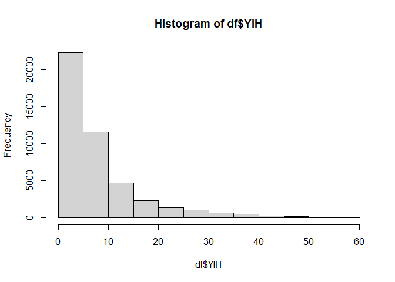<!-- -->

``` r
# The col option lets you change the colour of the histogram's bars:
hist(df$YIH, col = "plum2")
```

<!-- -->

``` r
# For a list of available colours you can go to this url:
# http://www.stat.columbia.edu/~tzheng/files/Rcolor.pdf

# You can also specify the range of values the axes can take. For histograms,
# you only need to specify the range for the x-axis. This determines what
# "slice" of the histogram you want to extract. If you set it to the min()
# and max(), it will show you the entire figure:
max_yih <- max(df$YIH, na.rm = TRUE)
min_yih <- min(df$YIH, na.rm = TRUE)

hist(df$YIH, col = "plum2",
     xlim = c(min_yih, max_yih))
```

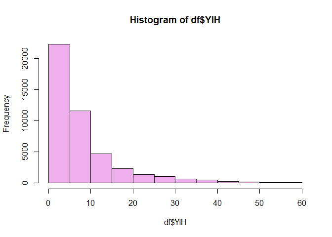<!-- -->

``` r
# But you could also "slice" the histogram so it only shows you the distribution
# between the 25th and 75th percentile:
yih_25 <- fivenum(df$YIH)[2]
yih_75 <- fivenum(df$YIH)[4]

hist(df$YIH, col = "plum2",
     xlim = c(yih_25, yih_75))
```

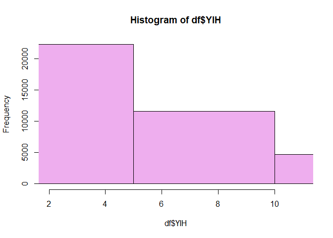<!-- -->

``` r
# You can also modify the number of breaks in the histogram.
# Let's try 4 breaks:
hist(df$YIH, breaks = 4)
```

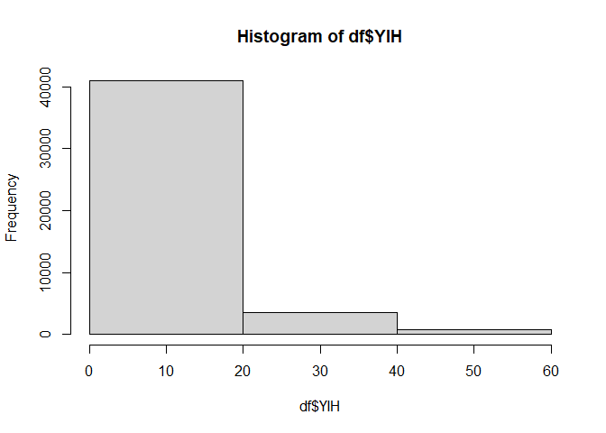<!-- -->

``` r
# If you want a break to appear at every 2 year interval, you'd need 30 breaks:
hist(df$YIH, breaks = 30)
```

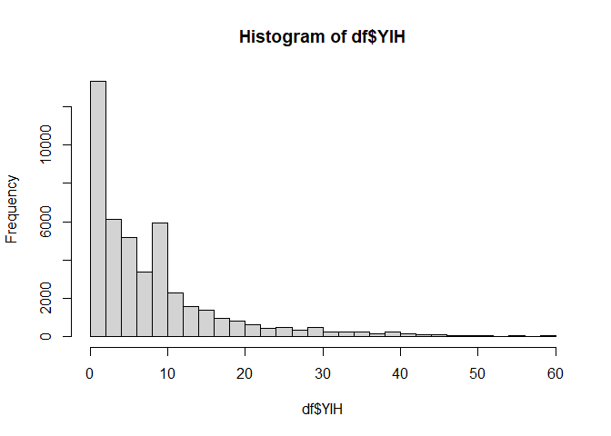<!-- -->

``` r
# Rather than guessing, you can integrate arithemetic functions. For instance,
# you could divide the maximum score of the variable by the interval at which
# you want the breaks to occur. If you want breaks every 5 years, then:
b <- max_yih / 5
hist(df$YIH, breaks = b)
```

<!-- -->

``` r
# You can then change the labels of the
# histogram with the main and xlab options:
hist(df$YIH,
     main = "Time lived at current address",
     xlab = "Years")
```

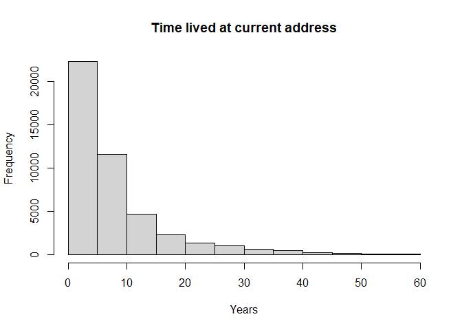<!-- -->

``` r
# Finally, the freq option allows you to switch between Frequency and Density:
hist(df$YIH, freq = FALSE)
```

<!-- -->

``` r
# Put this all together to create a histogram to your exact specifications:
hist(df$YIH,
     col = "plum2",
     xlim = c(min_yih, max_yih),
     breaks = b,
     main = "Time lived at current address",
     xlab = "Years",
     ylab = "Proportion",
     freq = FALSE)
```

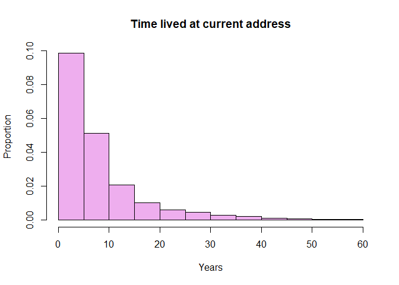<!-- -->

``` r
# ============================================================================ #

# The barplot() function is used to generate bar plots / graphs for count data:
(educ_table <- table(df$EDUC))
```

    ## 
    ##  NHSE   HSE    FE    MA   PHD 
    ##  3909 15933 18554  3229   376

``` r
barplot(educ_table)
```

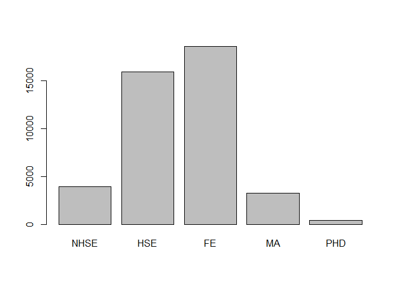<!-- -->

``` r
# All of the above options for histograms also apply to barplots().
# Here, I've introduced a few extra visual options (border and density),
# and also specified the individual colors and densities of each and
# every bar appearing in the plot. Note that this is defined as a vector
# created using the c() function:
barplot(educ_table,
        main = "Education Level",
        xlab = "Highest Degree Earned",
        ylab = "Total",
        col = c("plum2", "yellow", "lightblue", "blue", "red"),
        border = c("red", "brown", "blue", "darkblue", "darkred"),
        density = c(10, 20, 30, 40, 50))
```

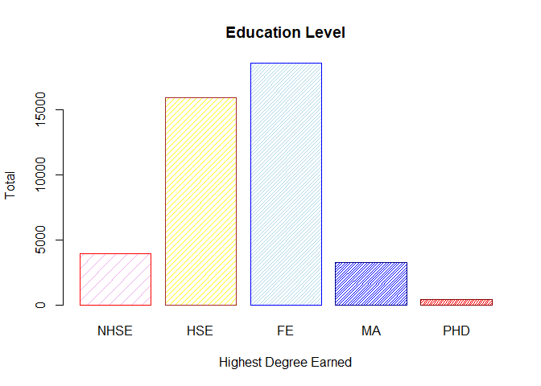<!-- -->

``` r
# Note that the default setting is to name the barplot() using the labels
# from the table() function (your factor labels). If you want to edit them,
# you can use the names.arg option:
barplot(educ_table,
        main = "Education Level",
        xlab = "Highest Degree Earned",
        ylab = "Total",
        col = c("plum2", "yellow", "lightblue", "blue", "red"),
        border = c("red", "brown", "blue", "darkblue", "darkred"),
        density = c(10, 20, 30, 40, 50),
        names.arg = c("No Formal Education",
                      "High School Equivalent",
                      "Bachelor's Degree",
                      "Master's Degree",
                      "Doctoral Degree"))
```

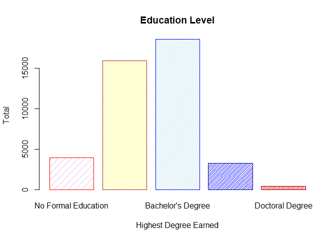<!-- -->

``` r
# You can also visualize crosstabs:
barplot(table(df$SEX, df$EDUC))
```

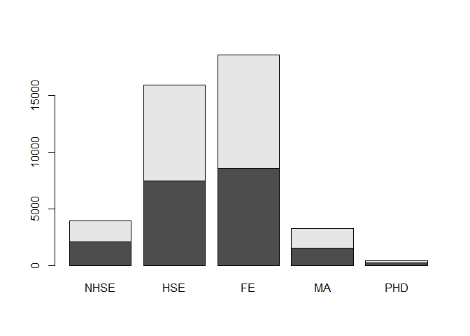<!-- -->

``` r
# However, without a legend, these can be difficult to read.
# So, let's add some extra visual options to help make it
# more easy to interpret. So, we can add a legend using 
# the legend() function:
barplot(table(df$SEX, df$EDUC),
        main = "Education Level by Gender",
        ylab = "Total",
        col = c("blue", "pink"),
        beside = TRUE)
legend("topright", c("Male", "Female"), 
       cex = 1,
       bty = "n",
       fill = c("blue", "pink"))
```

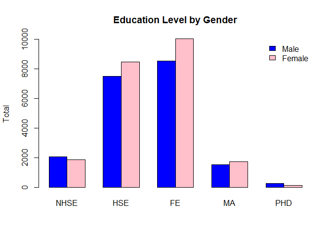<!-- -->

``` r
# The first two options should be the location and labels.
# cex specifies the size of the legend.
# bty specifies the type of box you want to surround the legend.
# fill specifies the colours associated with each
# (make sure they are in the same order as in the barplot).

# Reminder: the exact specification of the legend() function
# depends on the figure for which you are creating the legend.

# ============================================================================ #

# The pie() function generates pite charts, and functions very
# similarly to bar plots.
pie(table(df$EDUC),
    col = rainbow(5),
    main = "Education Level",
    labels = c("No Formal Education",
               "High School Equivalent",
               "Bachelor's Degree",
               "Master's Degree",
               "Doctoral Degree"))

legend("topleft", 0.5, c("No Formal Education",
                         "High School Equivalent",
                         "Bachelor's Degree",
                         "Master's Degree",
                         "Doctoral Degree"),
       cex = 0.8,
       fill = rainbow(5))
```

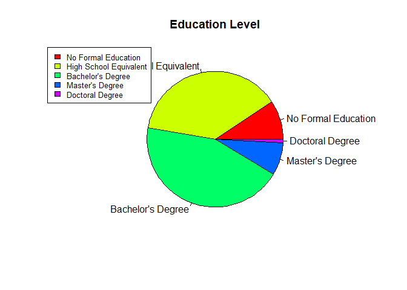<!-- -->

``` r
# ============================================================================ #

# The boxplot function generates boxplots:
boxplot(df$YIH)
```

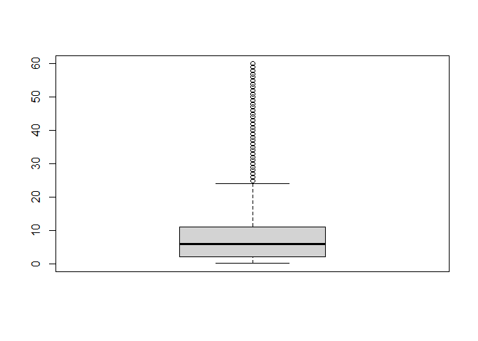<!-- -->

``` r
# As with the other graphing functions, boxplots come with it its own set of
# options, some of which are shared by other basic graph functions:
boxplot(df$YIH ~ df$EDUC,
        main = "Years in Home",
        ylab = "Years",
        xlab = "Education Level",
        col = heat.colors(5),
        notch = TRUE)
```

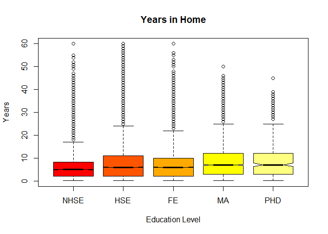<!-- -->

``` r
# ============================================================================ #

# Both line charts and scatterplots use the plot() function.
# The plot() function tends to be a little more complex than the
# prior functions.

# To plot an example line graph we begin by plotting a vector
# of 5 numbers. In this example let's assume each number is a score
# out of 10 on a maths test.

# The plot() function will simply plot these points on a 2D plane.

mathscores <- c(2, 5, 6, 3, 5)
plot(mathscores)
```

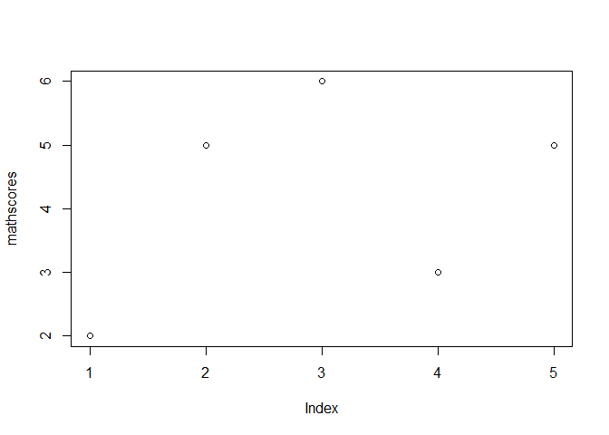<!-- -->

``` r
# By introducing the type option we tell R what we want to plot.
# The type="l" option will plot lines, the type="o" option
# will plot both points and lines.

plot(mathscores, type = "l",col = "red")
```

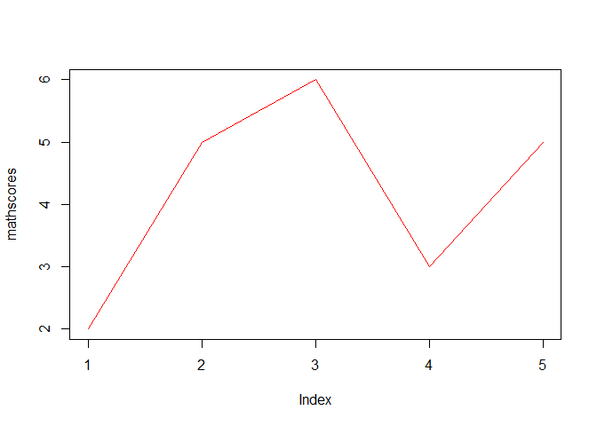<!-- -->

``` r
plot(mathscores, type = "o",col = "red")
```

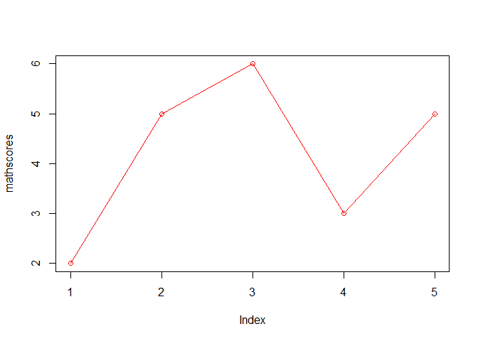<!-- -->

``` r
# If we have scores on an maths test for two people, we can combine
# the plot() and line() functions.

personA <- c(2, 5, 6, 3, 5)
personB <- c(3, 4, 7, 2, 2)

plot(personA, type = "o", col = "red", ylim = c(0, 10))

# The lines() function will then overlay a second set of lines and points.
# The pch, lty, and col options identifies the shape of the points,
# the type of line, and the color of the line.
lines(personB, type = "o", pch = 22, lty = 2, col = "blue")

# You can then use the title() function to add a title.
title(main = "Maths Test Scores by Day", font.main = 2)
```

<!-- -->

``` r
# You will notice that certain functions add to previously generated graphs.
# This applies to the axis(), box(), lines(), title(), and legend() functions.
# Using these functions in conjunction with plot() you can plot a graph from
# the ground up. Run the following lines of code one at a time for an example:

par(mar = c(5, 5, 4, 4))

plot(personA,
     type = "o",
     col = "red",
     ylim = c(1, 10),
     axes = FALSE,
     ann = FALSE)

axis(1, 1:5, lab = c("Mon", "Tue", "Wed", "Thu", "Fri"))

axis(2, 1:10)

box()

lines(personB, type = "o", pch = 22, lty = 2, col = "blue")

title(main = "Test Scores by Day", font.main = 2)

title(xlab = "Days", font.main = 3)

title(ylab = "Test Scores", font.main = 3)

legend(4, 9, c("Person A", "Person B"),
       cex = 0.8,
       col = c("red", "blue"),
       pch = 21:22,
       lty = 1:2)
```

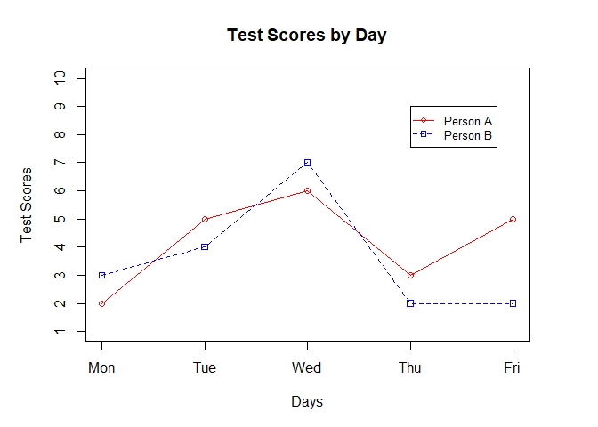<!-- -->

``` r
# The par() function defines the graph margins.
# If you find that your plot is not displaying an
# axis title then you may want to try running this
# code before using the plot() function.
par(mar = c(5, 5, 4, 4))

# You generate scatterplots in much the same way, except this time you
# identify the two variable vectors from your data which you wish
# to plot with one another. In this example we have Years in Household
# on the y axis and Age on the x axis.
plot(x = as.numeric(df$AGE),
     y = df$YIH,
     main = "Scatterplot Example",
     xlab = "Age",
     ylab = "Years in Household",
     pch = 19)
```

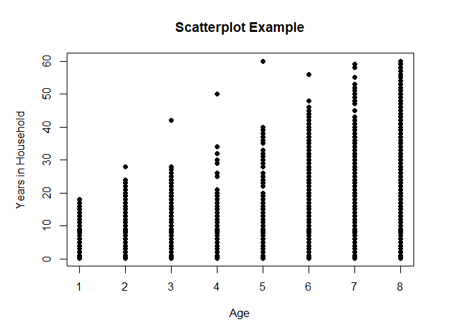<!-- -->

``` r
# You can use the jitter() function in situations where you have a lot
# of overlaid points on the scatterplot:
x <- jitter(as.numeric(df$AGE), 1.5)
y <- jitter(df$YIH, 20)

plot(x = x,
     y = y,
     main = "Scatterplot Example",
     xlab = "Age",
     ylab = "Years in Household",
     pch = 19)

# Using the abline() function we can plot the results of an ordinary
# least squares (OLS) regression, which are fit using the lm()
# function. We will be covering linear models in the next workshop.
abline(lm(YIH ~ as.numeric(AGE), df),
       lwd = 5,
       col = "red")
```

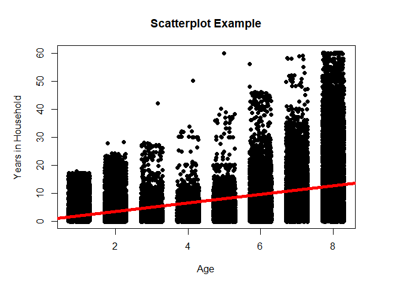<!-- -->

# 5 3-Dimensional Scatter Plots

- To showcase some of the more niche R packages, try exploring the
  following functions which are able to generate renderings of
  3-dimensional plots.
  - The **scatterplot3d** package gives you access to the
    `scatterplot3d()` function, which can be used to generate
    2-dimensional renderings of 3-dimensional scatterplots (including an
    x, y, and z axis). These visualizations are formatted in such a way
    that they conform to the aforementioned base R graphical functions,
    using many of the same options as those graphical functions which
    are discussed above.
  - The **rgl** package gives you access to the `plot3d()` function.
    This function will generate an interactive 3-dimensional rendering
    of a 3-dimensional scatterplot. The resulting graph will appear in a
    window separate to R and can be moved around using the mouse.
  - The **Rcmdr** packages gives you access to the `scatter3d()`
    function, which performs the same role as the `plot3d()` function
    but produces 3-dimensional graphics which are more aeshtetically
    pleasing in return for less required effort.

``` r
# Once you have mastered the basic graph functionality in R, you can start
# using packages which apply similar logic but with more impressive output.

# 2D visualizations of scatter plots with 3 variables using scatterplot3d:
plt <- scatterplot3d(as.numeric(df$AGE), as.numeric(df$EDUC), df$YIH,
                      pch = 16,
                      highlight.3d = TRUE,
                      type = "h",
                      main = "3D Scatterplot",
                      xlab = "Age",
                      ylab = "Education Level",
                      zlab = "Years in Household")
fit <- lm(YIH ~ as.numeric(AGE) + as.numeric(EDUC), df)
plt$plane3d(fit)
```

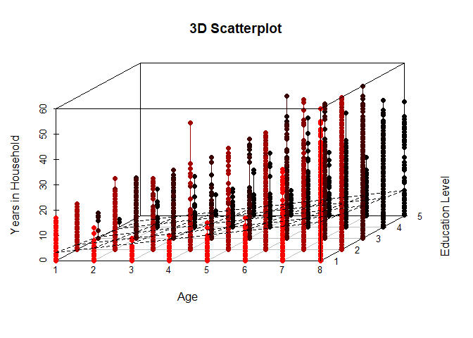<!-- -->

``` r
# 3D visualizations of scatter plots with 3 variables:
## rgl
plot3d(df$AGE, df$EDUC, df$YIH, col = "red", size = 3)

## Rcmdr
scatter3d(YIH ~ as.numeric(AGE) + as.numeric(EDUC),
          data = df)
```

    ## Loading required namespace: mgcv

# 6 ggplot2

- The package **ggplot2** offers a flexible set of functions which
  produce graphics that are polished and aesthetically pleasing when
  compared with the graphics which can be generated by the base R graph
  functions.
- **ggplot2** has a large user base, which means you will often be able
  to find guidance online at websites such as www.stackoverflow.com.
- It can be used to generate many different types of plot. Here we
  showcase histograms, bar plots, and, most importantly, scatterplots.
  - **ggplot2** is especially useful for generating professional, fairly
    complicated scatterplots with less effort than is required for base
    R graphics, which is to say **ggplot2** is more efficient at
    generating high quality graphics and is far more intuitive.
- The following code chunk introduces some of the more basic functions
  of **ggplot2**, namely `ggplot()`, `geom_histogram()`, `geom_bar()`,
  `geom_point()`, `geom_line()`, `geom_smooth()`, `geom_text()`, and
  `labs()`. Moreover, we demonstrate the use of the
  `scale_color_continuous()` function from the **scales** package which
  enhance the range of available colours and use of text for your
  graphics.

``` r
# Arguably the most comprehensive graphical package in R,
# ggplot2 can be used to generate impressive graphics.
# It is part of the tidyverse suite of packages.

# ggplot2 produces more impressive graphics with far fewer options:
## Base R
hist(df$YIH,
     col = "plum2",
     xlim = c(min_yih, max_yih),
     breaks = b,
     main = "Time lived at current address",
     xlab = "Years",
     ylab = "Proportion",
     freq = FALSE)
```

<!-- -->

``` r
## ggplot2
ggplot(df, aes(x = YIH)) +
  geom_histogram(fill = "plum2",  # fill specifies bar color
                 col = "pink",    # col specifies border color
                 bins = b)          # bins specifies the number of bars
```

    ## Warning: Removed 548 rows containing non-finite outside the scale range
    ## (`stat_bin()`).

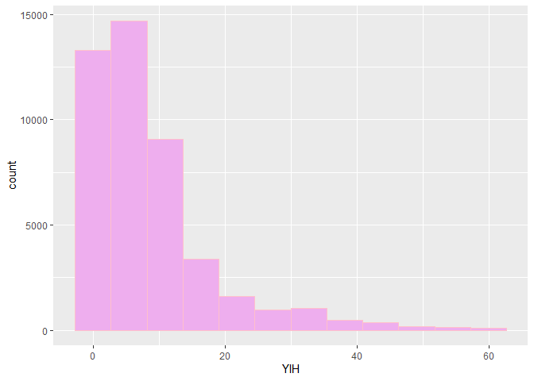<!-- -->

``` r
# You can also visualize bar plots:
ggplot(df, aes(x = EDUC, fill = SEX)) +
  geom_bar(position = "dodge")
```

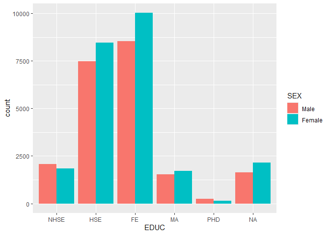<!-- -->

``` r
# But ggplot2 is especially good at generating scatter plots:
ggplot(df, aes(x = as.numeric(AGE), y = YIH)) +
  geom_point()
```

    ## Warning: Removed 548 rows containing missing values or values outside the scale range
    ## (`geom_point()`).

<!-- -->

``` r
# And a jittered scatterplot is considerably less effort:
ggplot(df, aes(x = as.numeric(AGE), y = YIH)) +
  geom_jitter()
```

    ## Warning: Removed 548 rows containing missing values or values outside the scale range
    ## (`geom_point()`).

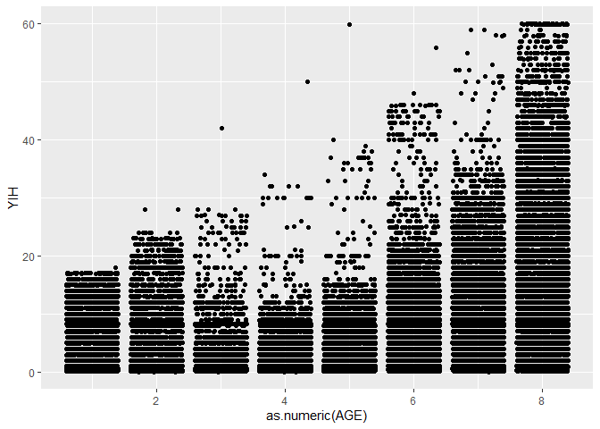<!-- -->

``` r
# As with everything in R, you can assign the "core" of your graph
# to an object:
mygraph <- ggplot(df, aes(x = as.numeric(AGE), y = YIH))

# Printing this object will show the graph (currently empty!):
mygraph
```

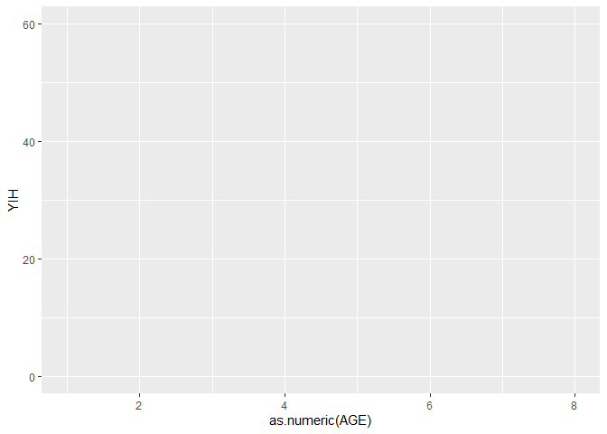<!-- -->

``` r
# This will allow us to examine the influence of a third, grouping
# variable much easier than when using base R functions:
mygraph + geom_jitter(aes(color = SEX))
```

    ## Warning: Removed 548 rows containing missing values or values outside the scale range
    ## (`geom_point()`).

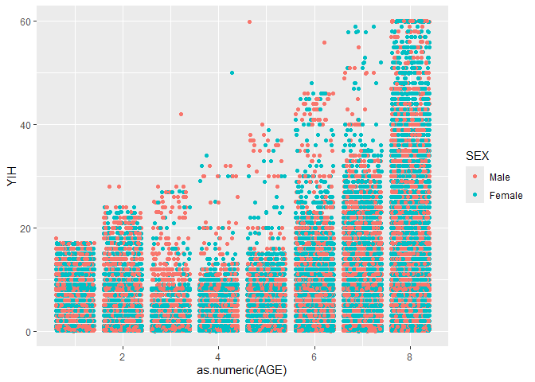<!-- -->

``` r
mygraph + geom_jitter(aes(color = NONVIOLENT > 0))
```

    ## Warning: Removed 548 rows containing missing values or values outside the scale range
    ## (`geom_point()`).

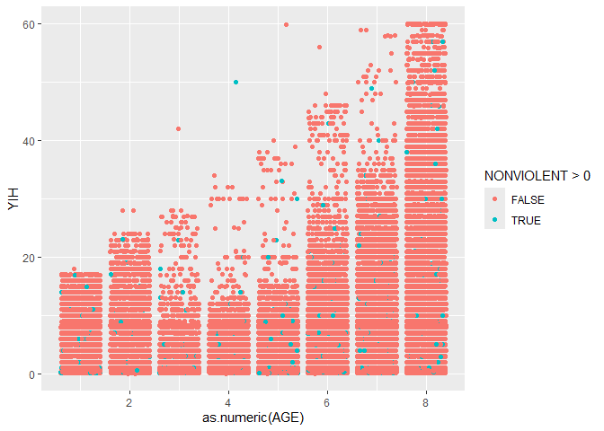<!-- -->

``` r
# Fitting regression lines to the scatterplot is also much easier:
ggplot(df, aes(x = as.numeric(AGE), y = YIH)) +
  geom_jitter() +
  geom_smooth(method = "lm")
```

    ## `geom_smooth()` using formula = 'y ~ x'

    ## Warning: Removed 548 rows containing non-finite outside the scale range
    ## (`stat_smooth()`).

    ## Warning: Removed 548 rows containing missing values or values outside the scale range
    ## (`geom_point()`).

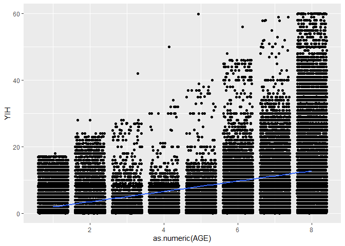<!-- -->

``` r
# By default, regression lines automatically estimate and visualize
# a confidence interval. This can be removed with the fill option:
ggplot(df, aes(x = as.numeric(AGE), y = YIH)) +
  geom_jitter() +
  geom_smooth(method = "lm", fill = NA)
```

    ## `geom_smooth()` using formula = 'y ~ x'

    ## Warning: Removed 548 rows containing non-finite outside the scale range
    ## (`stat_smooth()`).
    ## Removed 548 rows containing missing values or values outside the scale range
    ## (`geom_point()`).

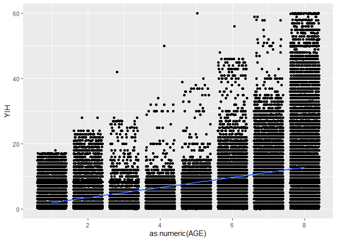<!-- -->

``` r
# You can also fit non-linear, non-parametric regression lines.
# This will help you ascertain which regression model you
# should be using with these data. The default is Loess regression:
ggplot(df, aes(x = as.numeric(YEAR), y = YIH)) +
  geom_jitter() +
  geom_smooth()
```

    ## `geom_smooth()` using method = 'gam' and formula = 'y ~ s(x, bs = "cs")'

    ## Warning: Removed 548 rows containing non-finite outside the scale range
    ## (`stat_smooth()`).
    ## Removed 548 rows containing missing values or values outside the scale range
    ## (`geom_point()`).

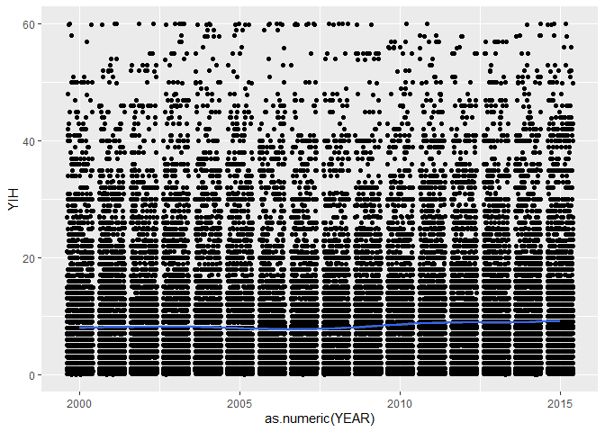<!-- -->

``` r
## Note: I switched to the "year" variable as Loess regression requires
## a minimum of 10 unique values for the x-axis. Due to the tendency
## of NCVS to collect ordinal data (and the skewness of the collected 
## interval and ratio level variables), I have been intentionally liberal
## with the treatment of ordinal variables.

# You can use geom_text() to replace the points with text:
ggplot(sample_n(df, 100), aes(x = as.numeric(AGE), y = YIH)) +
  geom_text(aes(label = SEX))
```

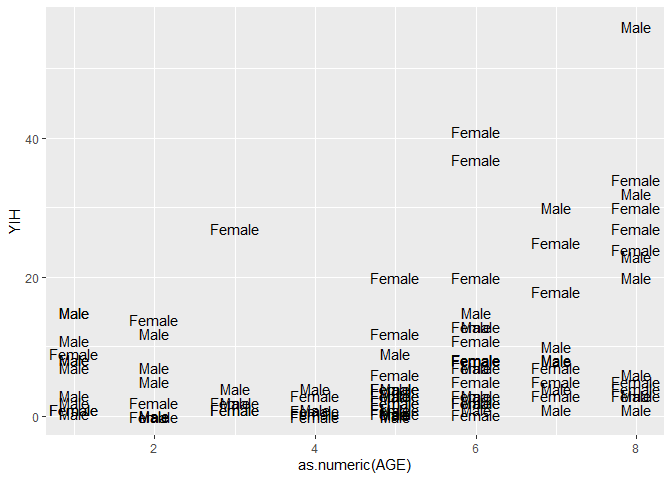<!-- -->

``` r
# Or you can use the color and shape option in the original function call:
ggplot(df, aes(x = as.numeric(AGE), y = YIH, color = SEX, shape = SEX)) +
  geom_jitter()
```

    ## Warning: Removed 548 rows containing missing values or values outside the scale range
    ## (`geom_point()`).

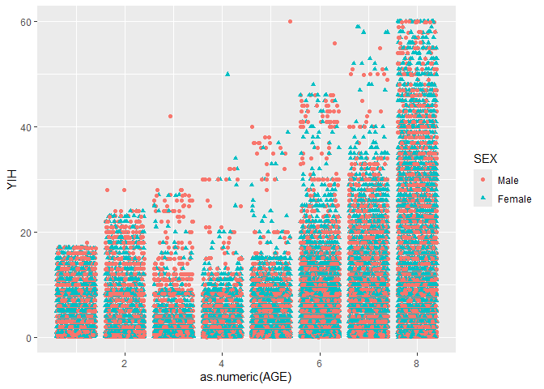<!-- -->

``` r
# One benefit of this approach is that it allows you to fit multiple
# regression lines, one for each group. This allows you to visualize
# statistical interactions:
ggplot(df, aes(x = as.numeric(AGE), y = YIH, color = SEX, shape = SEX)) +
  geom_jitter() +
  geom_smooth(method = "lm")
```

    ## `geom_smooth()` using formula = 'y ~ x'

    ## Warning: Removed 548 rows containing non-finite outside the scale range
    ## (`stat_smooth()`).
    ## Removed 548 rows containing missing values or values outside the scale range
    ## (`geom_point()`).

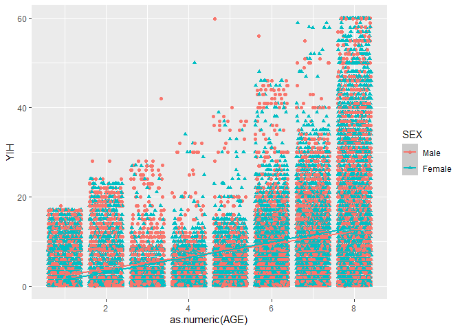<!-- -->

``` r
# Customizing your graph labels is also very intuitive if using labs():
graph <- ggplot(df, aes(x = as.numeric(AGE),
               y = YIH,
               color = SEX,
               shape = SEX)) +
  geom_jitter() + 
  geom_smooth(method = "lm") +
  labs(title = "Relationship between Age and Time in Household",
       subtitle = "Moderated by Sex",
       x = "Age (Years)",
       y = "Time in Household (Years)",
       color = "Sex",
       shape = "Sex")

graph
```

    ## `geom_smooth()` using formula = 'y ~ x'

    ## Warning: Removed 548 rows containing non-finite outside the scale range
    ## (`stat_smooth()`).
    ## Removed 548 rows containing missing values or values outside the scale range
    ## (`geom_point()`).

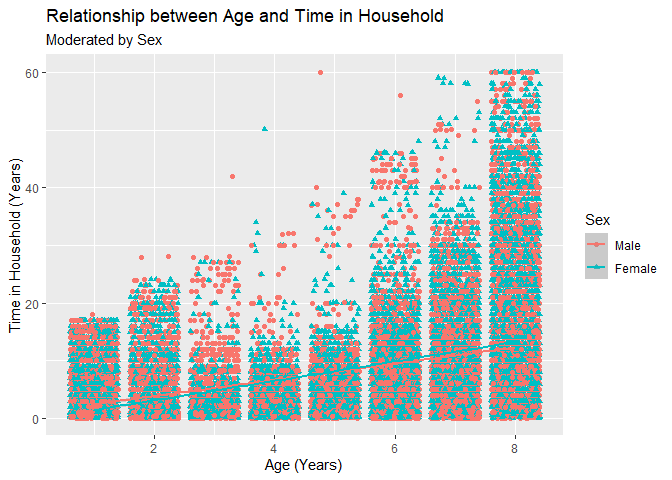<!-- -->

``` r
# Finally, the theme() family of functions can be used to easily
# change the aesthetic of your graph. Here are four examples:
## Classic
graph + theme_classic()
```

    ## `geom_smooth()` using formula = 'y ~ x'

    ## Warning: Removed 548 rows containing non-finite outside the scale range
    ## (`stat_smooth()`).
    ## Removed 548 rows containing missing values or values outside the scale range
    ## (`geom_point()`).

<!-- -->

``` r
## Dark
graph + theme_dark()
```

    ## `geom_smooth()` using formula = 'y ~ x'

    ## Warning: Removed 548 rows containing non-finite outside the scale range
    ## (`stat_smooth()`).
    ## Removed 548 rows containing missing values or values outside the scale range
    ## (`geom_point()`).

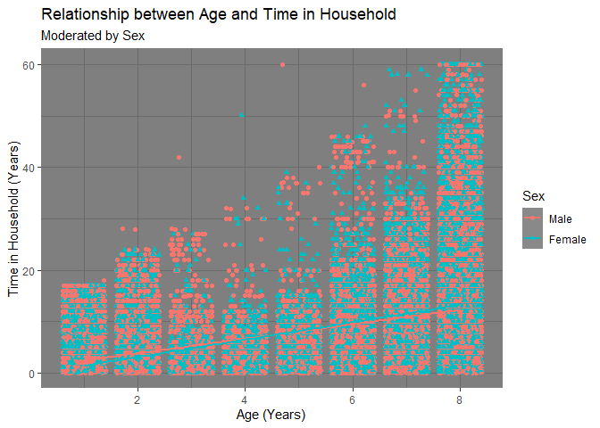<!-- -->

``` r
## Minimal
graph + theme_minimal()
```

    ## `geom_smooth()` using formula = 'y ~ x'

    ## Warning: Removed 548 rows containing non-finite outside the scale range
    ## (`stat_smooth()`).
    ## Removed 548 rows containing missing values or values outside the scale range
    ## (`geom_point()`).

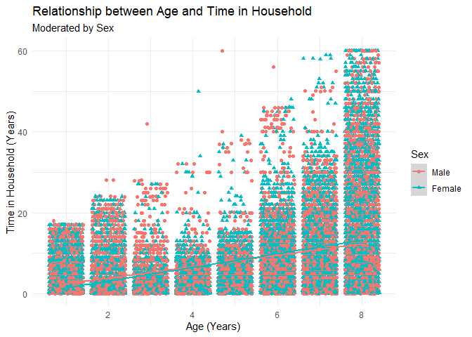<!-- -->

``` r
## Void
graph + theme_void()
```

    ## `geom_smooth()` using formula = 'y ~ x'

    ## Warning: Removed 548 rows containing non-finite outside the scale range
    ## (`stat_smooth()`).
    ## Removed 548 rows containing missing values or values outside the scale range
    ## (`geom_point()`).

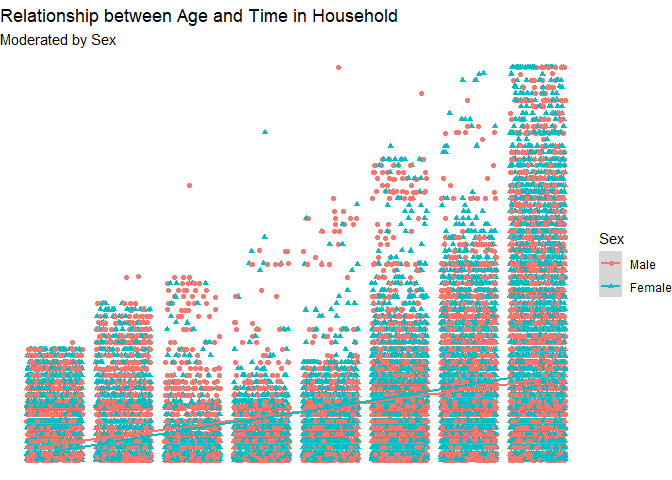<!-- -->

``` r
# You could also spend hours generating custom themes,
# and tinkering with the various options, creating your
# own custom color scales. The real benefit of this
# package is your ability to produce figures that are
# eye catching and impressive:
graph + 
  scale_color_manual(values = c("#e1ff00", "deeppink")) +
  theme(legend.background = element_rect(fill = "black"),
        legend.key = element_rect(fill = "black", color = "black"),
        panel.background = element_rect(fill = "black"),
        plot.background = element_rect(fill = "black"),
        text = element_text(color = "#77ff77"),
        axis.text = element_text(color = "#029b02"),
        panel.grid = element_line(color = "deeppink4"))
```

    ## `geom_smooth()` using formula = 'y ~ x'

    ## Warning: Removed 548 rows containing non-finite outside the scale range
    ## (`stat_smooth()`).
    ## Removed 548 rows containing missing values or values outside the scale range
    ## (`geom_point()`).

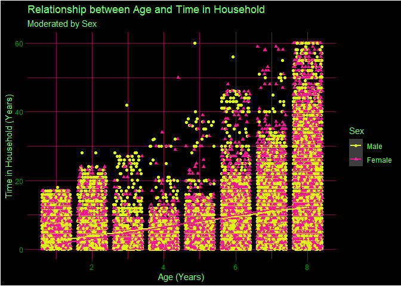<!-- -->

[^1]: University of Mississippi, <tbsmit10@olemiss.edu>
